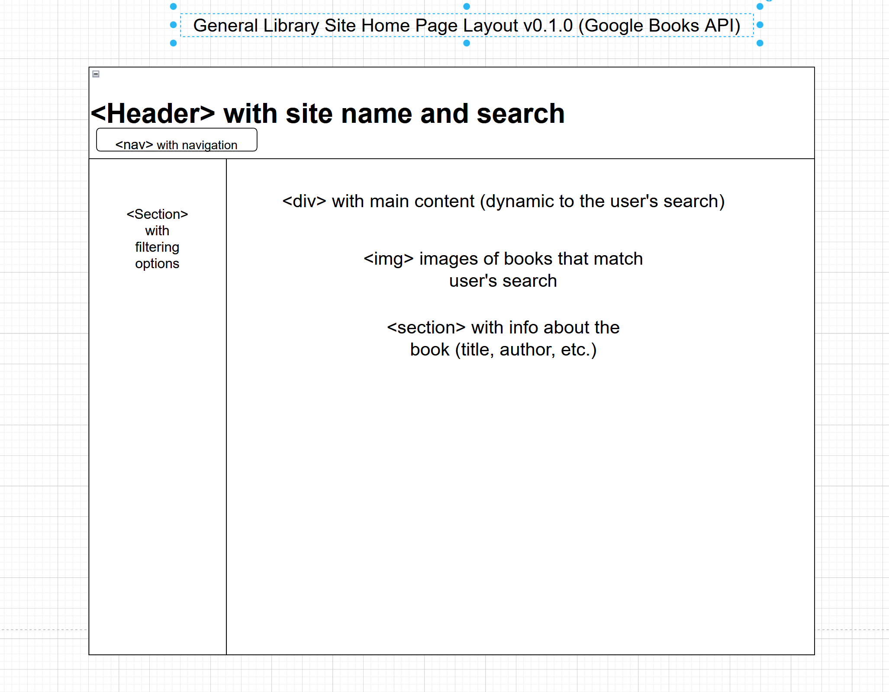
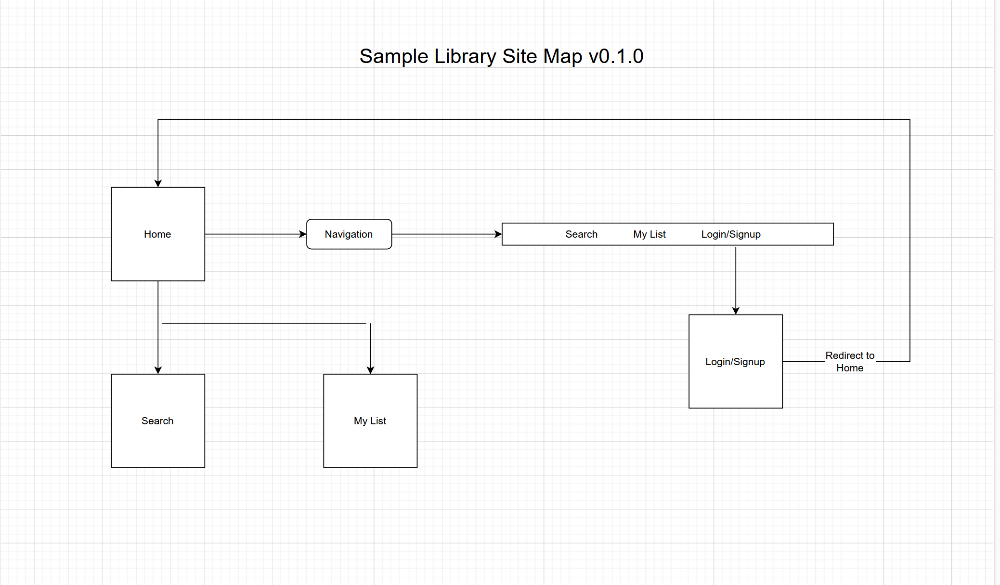

# Library website ############
Jake Caldwell  

This project proposal is for a library website that will allow a user  
to search for books and add them to a reading list or cart for later.  
The site will also have filtering and sorting capability, allowing the  
user to search by author and genre on top of title. A rating system  
will be implemented so that higher rated books are shown when searching  
by author and genre.  

## Web service ##############
[Google Books](https://developers.google.com/books) API & oAuth 2.0

+  General search: GET https://www.googleapis.com/books/v1/volumes?q=search+terms
+  Bookshelf search: GET https://www.googleapis.com/books/v1/mylibrary/bookshelves/shelf/volumes
+  Add a book to your list: POST https://www.googleapis.com/books/v1/mylibrary/bookshelves/shelf/addVolume 
+  Remove a book to your list: POST https://www.googleapis.com/books/v1/mylibrary/bookshelves/shelf/removeVolume 
+  Clear your list: POST https://www.googleapis.com/books/v1/mylibrary/bookshelves/shelf/clearVolumes

#### Database use ###########
Within the database I was going to make two tables. One would be a **books**  
table that has title, author, genre, summary, and rating. The other would  
be a **rating** table that numbers one through five to represent one through  
five star ratings. The rating table's primary key would be used as a foreign  
key in the books table to keep track of higher and lower rated books.  

#### Initial designs ########

